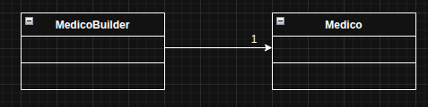

# Builder

O Builder é um padrão de projeto criacional usado para construir objetos complexos passo a passo, sem precisar colocar toda a lógica dentro de um único construtor enorme. Resumindo: você monta o objeto aos poucos, escolhendo quais partes incluir e como configurá-lo.

No exemplo usado, foi usado o padrão builder para o cadastro de um médico no sistema nacional, onde são necessários alguns dados cruciais, como CRM, CPF e nome.

